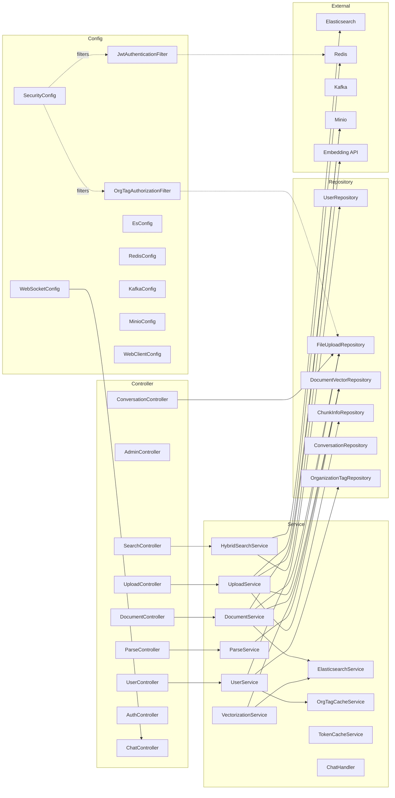
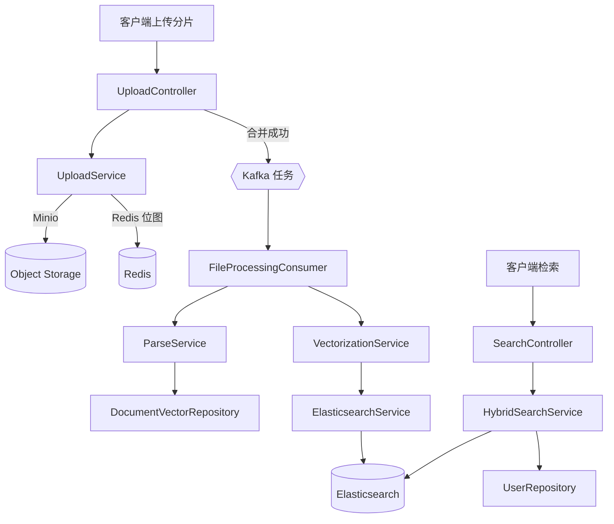
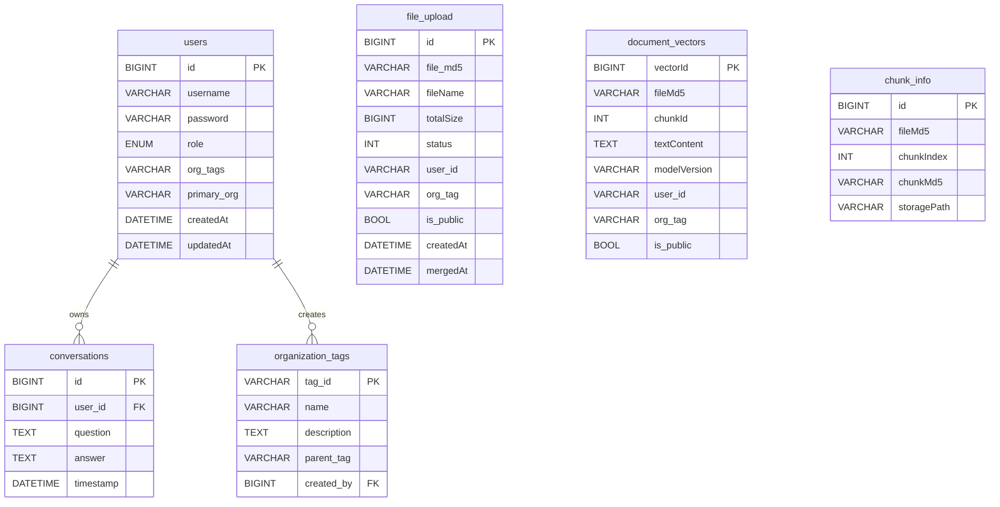

# PaiSmart 后端技术文档（src）

## 概览
- 技术栈：Spring Boot、Spring Security/JWT、JPA、Redis、Kafka、Minio、Elasticsearch、WebSocket
- 入口：`src/main/java/com/yizhaoqi/smartpai/SmartPaiApplication.java`
- 资源配置：`src/main/resources/application.yml`、`application-dev.yml`、`application-docker.yml`
- 日志与映射：`logback-spring.xml`、`es-mappings/knowledge_base.json`

## 项目结构说明
- 根包：`com.yizhaoqi.smartpai`
- 子包与职责：
  - `controller`：REST 控制器，暴露 HTTP API
  - `service`：业务逻辑（解析、向量化、检索、文档管理、用户与组织标签）
  - `repository`：JPA 仓库（`JpaRepository` 与自定义查询）
  - `model`：JPA 实体（数据库表映射）
  - `entity`：DTO/VO（非持久化，例如检索结果）
  - `config`：安全、WebSocket、Elasticsearch、Redis、Kafka、Minio 等配置
  - `consumer`：Kafka 消费者（异步文件处理）
  - `handler`：WebSocket 处理器
  - `utils`：通用工具（JWT、密码等）
  - `exception`：自定义异常
  - `test`：测试控制器与实体



## 核心模块文档
- 用户模块（UserService）
  - 注册用户、加密密码与初始组织标签创建
  - 管理主组织标签、组织标签分配与缓存
  - 参考：`src/main/java/com/yizhaoqi/smartpai/service/UserService.java`
- 文件上传模块（UploadService）
  - 分片上传至 Minio，Redis 记录位图进度，合并分片并生成预签名 URL
  - 参考：`src/main/java/com/yizhaoqi/smartpai/service/UploadService.java`
- 文档管理模块（DocumentService）
  - 删除文档（Minio 文件、ES 文档、DB 文档向量与上传记录）、生成下载与预览
  - 参考：`src/main/java/com/yizhaoqi/smartpai/service/DocumentService.java`
- 解析模块（ParseService）
  - Apache Tika 流式解析，父块-子切片策略，HanLP 中文切分，入库 `DocumentVector`
  - 参考：`src/main/java/com/yizhaoqi/smartpai/service/ParseService.java`
- 向量化模块（VectorizationService）
  - 调用外部向量服务，批量索引到 Elasticsearch
  - 参考：`src/main/java/com/yizhaoqi/smartpai/service/VectorizationService.java`
- 检索模块（HybridSearchService）
  - KNN + BM25 混合检索，基于用户有效组织标签与公开权限过滤
  - 参考：`src/main/java/com/yizhaoqi/smartpai/service/HybridSearchService.java`
- 安全与授权（SecurityConfig、JwtAuthenticationFilter、OrgTagAuthorizationFilter）
  - JWT 认证、自动刷新、基于组织标签的资源授权与请求属性注入（`userId`/`role`/`orgTags`）
  - 参考：`src/main/java/com/yizhaoqi/smartpai/config/SecurityConfig.java`、`JwtAuthenticationFilter.java`、`OrgTagAuthorizationFilter.java`
- 消费者模块（FileProcessingConsumer）
  - 监听 Kafka 任务，下载文件、调用解析与向量化
  - 参考：`src/main/java/com/yizhaoqi/smartpai/consumer/FileProcessingConsumer.java`



## API 文档
- 用户相关（`/api/v1/users`）
  - `POST /register` 注册用户
    - 请求体：`{"username": "alice", "password": "***"}`
    - 响应：`{"code":200,"message":"User registered successfully"}`
    - 参考：`src/main/java/com/yizhaoqi/smartpai/controller/UserController.java:35`
  - `POST /login` 登录获取 `token` 与 `refreshToken`
    - 请求体：同上
    - 响应数据：`data.token`、`data.refreshToken`
    - 参考：`UserController.java:64`
  - `GET /me` 获取当前用户信息
    - 头：`Authorization: Bearer <token>`
    - 响应字段：`id, username, role, orgTags, primaryOrg, createdAt, updatedAt`
    - 参考：`UserController.java:101`
  - `GET /org-tags` 用户组织标签与主组织
    - 头：`Authorization: Bearer <token>`
    - 参考：`UserController.java:153`
  - `PUT /primary-org` 设置主组织
    - 头：`Authorization: Bearer <token>`
    - 请求体：`{"primaryOrg":"ORG_X"}`
    - 参考：`UserController.java:187`
  - `GET /upload-orgs` 上传文件前获取用户组织上下文
    - 属性：`@RequestAttribute("userId")` 由过滤器注入
    - 参考：`UserController.java:223`
  - `POST /logout` 当前令牌登出；`POST /logout-all` 批量登出
    - 参考：`UserController.java:257`、`UserController.java:292`

- 管理端（`/api/v1/admin`）
  - 用户列表与筛选、管理员创建、组织标签 CRUD、系统状态与对话历史
  - 参考端点：`AdminController.java`
    - `GET /users`、`GET /users/list`
    - `POST /users/create-admin`
    - `POST /org-tags`、`GET /org-tags`、`GET /org-tags/tree`、`PUT /org-tags/{tagId}`、`DELETE /org-tags/{tagId}`
    - `GET /system/status`、`GET /user-activities`、`GET /conversation`

- 上传与解析（`/api/v1/upload`、`/api/v1/parse`）
  - `POST /upload/chunk` 分片上传（`fileMd5, chunkIndex, totalSize, fileName, orgTag?, isPublic?, file`）
    - 属性注入：`@RequestAttribute("userId")`
    - 参考：`UploadController.java:67`
  - `GET /upload/status` 查询上传进度（`file_md5`）
    - 参考：`UploadController.java:167`
  - `POST /upload/merge` 合并分片并发 Kafka 任务
    - 参考：`UploadController.java:227`
  - `GET /upload/supported-types` 支持的类型列表
    - 参考：`UploadController.java:351`
  - `POST /api/v1/parse` 兼容旧入口（表单：`file`、`file_md5`）
    - 参考：`ParseController.java:17`

- 文档管理（`/api/v1/documents`）
  - `DELETE /{fileMd5}` 删除（文件所有者或管理员）
    - 属性：`@RequestAttribute("userId")`、`@RequestAttribute("role")`
    - 参考：`DocumentController.java:57`
  - `GET /accessible` 用户可访问文件列表
    - 属性：`@RequestAttribute("userId")`、`@RequestAttribute("orgTags")`
    - 参考：`DocumentController.java:117`
  - `GET /uploads` 用户上传文件列表
    - 属性：`@RequestAttribute("userId")`
    - 参考：`DocumentController.java:153`
  - `GET /download?fileName=` 生成下载链接（可匿名下载公开文件）
    - 参考：`DocumentController.java:208`
  - `GET /preview?fileName=` 获取预览（文本前 10KB 或文件信息）
    - 参考：`DocumentController.java:333`

- 检索（`/api/v1/search`）
  - `GET /hybrid?query=&topK=` 混合检索（带权限或公开内容）
    - 属性：`@RequestAttribute("userId")`（可选）
    - 参考：`SearchController.java:46`

- 对话历史（`/api/v1/users/conversation`）
  - `GET` 获取自身对话（时间范围过滤）
    - 头：`Authorization: Bearer <token>`
    - 参考：`ConversationController.java:44`

- 认证（`/api/v1/auth`）
  - `POST /refreshToken` 刷新令牌
    - 参考：`AuthController.java:24`
  - `GET /error` 测试错误接口
    - 参考：`AuthController.java:79`

示例请求（混合检索，带权限）：

```bash
curl -G "http://localhost:8081/api/v1/search/hybrid" \
  -d query="人工智能" -d topK=10 \
  -H "Authorization: Bearer <token>"
```

示例请求（分片上传）：

```bash
curl -X POST "http://localhost:8081/api/v1/upload/chunk" \
  -H "Authorization: Bearer <token>" \
  -F fileMd5=abc123... -F chunkIndex=0 -F totalSize=10485760 \
  -F fileName="demo.pdf" -F file=@part0.bin -F isPublic=false
```

## 数据库设计
- 表与实体映射（JPA）
  - `users`（`User`）主键 `id`，`username` 唯一，`password`，`role`，`org_tags`，`primary_org`，`createdAt`，`updatedAt`
    - 参考：`src/main/java/com/yizhaoqi/smartpai/model/User.java:10`
  - `organization_tags`（`OrganizationTag`）`tag_id` 主键，`name`，`description`，`parent_tag`，`created_by` 外键（`User`）
    - 参考：`OrganizationTag.java:10`
  - `file_upload`（`FileUpload`）`id` 主键，`file_md5`，`fileName`，`totalSize`，`status`，`user_id`（字符串），`org_tag`，`is_public`，`createdAt`，`mergedAt`
    - 参考：`FileUpload.java:14`
  - `document_vectors`（`DocumentVector`）`vectorId` 主键，`fileMd5`，`chunkId`，`textContent`，`modelVersion`，`user_id`，`org_tag`，`is_public`
    - 参考：`DocumentVector.java:12`
  - `conversations`（`Conversation`）`id` 主键，`user_id` 外键（`User`），`question`，`answer`，`timestamp`（索引）
    - 参考：`Conversation.java:11`
  - `chunk_info`（`ChunkInfo`）`id` 主键，`fileMd5`，`chunkIndex`，`chunkMd5`，`storagePath`
    - 参考：`ChunkInfo.java:13`



- 主要查询示例
  - `FileUploadRepository.findAccessibleFilesWithTags(userId, orgTagList)` 复合权限查询
    - 参考：`src/main/java/com/yizhaoqi/smartpai/repository/FileUploadRepository.java:42`
  - `DocumentVectorRepository.deleteByFileMd5(String fileMd5)` 批量删除（native SQL）
    - 参考：`DocumentVectorRepository.java:19`
  - `ChunkInfoRepository.findByFileMd5OrderByChunkIndexAsc(String fileMd5)` 分片顺序查询
    - 参考：`ChunkInfoRepository.java:9`

## 配置说明
- 环境变量与属性（示例键，实际值请通过环境注入，勿硬编码）
  - `jwt.secret-key`
  - `minio.endpoint`、`minio.accessKey`、`minio.secretKey`、`minio.publicUrl`
  - `spring.kafka.*`（`bootstrap-servers`、`producer/consumer`）
  - `elasticsearch.host`、`elasticsearch.port`、`elasticsearch.scheme`、`elasticsearch.username`、`elasticsearch.password`
  - `embedding.api.url`、`embedding.api.key`、`embedding.api.model`、`embedding.api.batch-size`、`embedding.api.dimension`
  - `file.parsing.chunk-size`、`file.parsing.buffer-size`、`file.parsing.max-memory-threshold`
  - `admin.username` 等初始化账号属性
- 配置类与注入点
  - 参考：`EsConfig.java`、`WebClientConfig.java`、`MinioConfig.java`、`KafkaConfig.java`、`RedisConfig.java`
- 部署要求
  - JDK 17+、Maven 3.8+
  - MySQL 8（数据库名 `PaiSmart`）
  - Redis、Kafka、Elasticsearch、Minio 服务可用
  - 应用端口：`server.port` 默认 `8081`
  - Profile：`application.yml`（默认）、`application-dev.yml`（开发）、`application-docker.yml`（容器）

## 代码示例
- JWT 生成与刷新（片段）
```java
// src/main/java/com/yizhaoqi/smartpai/utils/JwtUtils.java:48
public String generateToken(String username) {
  SecretKey key = getSigningKey();
  User user = userRepository.findByUsername(username).orElseThrow();
  Map<String,Object> claims = new HashMap<>();
  claims.put("tokenId", generateTokenId());
  claims.put("role", user.getRole().name());
  claims.put("userId", user.getId().toString());
  if (user.getOrgTags()!=null) claims.put("orgTags", user.getOrgTags());
  if (user.getPrimaryOrg()!=null) claims.put("primaryOrg", user.getPrimaryOrg());
  return Jwts.builder().setClaims(claims).setSubject(username)
    .setExpiration(new Date(System.currentTimeMillis()+EXPIRATION_TIME))
    .signWith(key, SignatureAlgorithm.HS256).compact();
}
```

- 分片上传与合并（片段）
```java
// src/main/java/com/yizhaoqi/smartpai/service/UploadService.java
public void uploadChunk(String fileMd5,int chunkIndex,long totalSize,String fileName,
  MultipartFile file,String orgTag,boolean isPublic,String userId){
  if (!fileUploadRepository.findByFileMd5AndUserId(fileMd5,userId).isPresent()) {
    var fu=new FileUpload(); fu.setFileMd5(fileMd5); fu.setFileName(fileName);
    fu.setTotalSize(totalSize); fu.setStatus(0); fu.setUserId(userId);
    fu.setOrgTag(orgTag); fu.setPublic(isPublic); fileUploadRepository.save(fu);
  }
  String storagePath = "chunks/"+fileMd5+"/"+chunkIndex;
  minioClient.putObject(PutObjectArgs.builder().bucket("uploads")
    .object(storagePath).stream(file.getInputStream(), file.getSize(), -1)
    .contentType(file.getContentType()).build());
  markChunkUploaded(fileMd5, chunkIndex, userId);
  saveChunkInfo(fileMd5, chunkIndex, DigestUtils.md5Hex(file.getBytes()), storagePath);
}

public String mergeChunks(String fileMd5,String fileName,String userId){
  var parts = chunkInfoRepository.findByFileMd5OrderByChunkIndexAsc(fileMd5)
    .stream().map(ChunkInfo::getStoragePath).toList();
  minioClient.composeObject(ComposeObjectArgs.builder().bucket("uploads")
    .object("merged/"+fileName)
    .sources(parts.stream().map(p->ComposeSource.builder().bucket("uploads").object(p).build()).toList())
    .build());
  return minioClient.getPresignedObjectUrl(GetPresignedObjectUrlArgs.builder()
    .method(Method.GET).bucket("uploads").object("merged/"+fileName)
    .expiry(1, TimeUnit.HOURS).build());
}
```

- 混合检索（片段）
```java
// src/main/java/com/yizhaoqi/smartpai/service/HybridSearchService.java
SearchResponse<EsDocument> response = esClient.search(s -> {
  s.index("knowledge_base");
  int recallK = topK*30;
  s.knn(kn->kn.field("vector").queryVector(queryVector).k(recallK).numCandidates(recallK));
  s.query(q->q.bool(b->b.must(m->m.match(mm->mm.field("textContent").query(query)))
    .filter(f->f.bool(bf->bf.should(s1->s1.term(t->t.field("userId").value(userDbId)))
      .should(s2->s2.term(t->t.field("public").value(true)))
      .should(s3->{ /* orgTag terms */ return s3; }) ))));
  s.rescore(r->r.windowSize(recallK).query(rq->rq.queryWeight(0.2).rescoreQueryWeight(1.0)
    .query(rqq->rqq.match(m->m.field("textContent").query(query).operator(Operator.And)))));
  s.size(topK); return s;
}, EsDocument.class);
```

## 安全与合规
- 严禁在代码库与文档中硬编码敏感信息（API Key、密码、JWT 密钥等）；所有密钥通过环境与配置注入。
- 所有文件访问与删除均执行权限校验（资源所有者、管理员或组织标签匹配）。
- WebSocket Token 内部指令通过服务端下发的内部令牌字段验证。

## 附录：代码引用定位
- 用户登录：`src/main/java/com/yizhaoqi/smartpai/controller/UserController.java:64`
- 刷新令牌：`src/main/java/com/yizhaoqi/smartpai/controller/AuthController.java:24`
- 分片上传：`src/main/java/com/yizhaoqi/smartpai/controller/UploadController.java:67`
- 合并分片：`src/main/java/com/yizhaoqi/smartpai/controller/UploadController.java:227`
- 文档删除：`src/main/java/com/yizhaoqi/smartpai/controller/DocumentController.java:57`
- 混合检索：`src/main/java/com/yizhaoqi/smartpai/controller/SearchController.java:46`
- 对话历史：`src/main/java/com/yizhaoqi/smartpai/controller/ConversationController.java:44`
- WebSocket 配置：`src/main/java/com/yizhaoqi/smartpai/config/WebSocketConfig.java:19`

